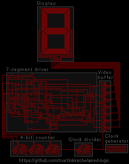
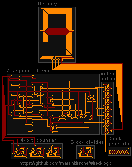

Wired Logic
===========

Wired Logic can turn a still image like this…

…into an animation like that…

How to run it?
--------------

    go run wired-logic.go input.gif output.gif
    
How does it work?
-----------------

It scans the image, converts it into a collection of wires, power sources and
transistors and runs a simulation on them as long as the state of the 
simulation does not recur. Then it renders the simulation into the animated
gif image.

### The rules

1. Wires are all pixels of the color from index 1 to 7 within the palette.
2. A 2x2 pixel square within a wire will make the wire a power source.
3. Wires can cross each other by poking a hole in the middle of their crossing.
4. A transistor gets created by drawing an arbitrarily rotated T-shape and, 
   you guessed it, poking a hole in the middle of their crossing.  

If a transistor's base gets charged it will stop current from flowing. If not, 
current will flow but gets reduced by one.